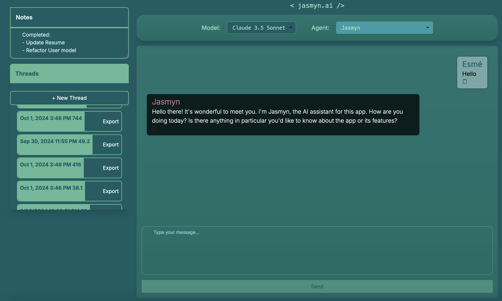
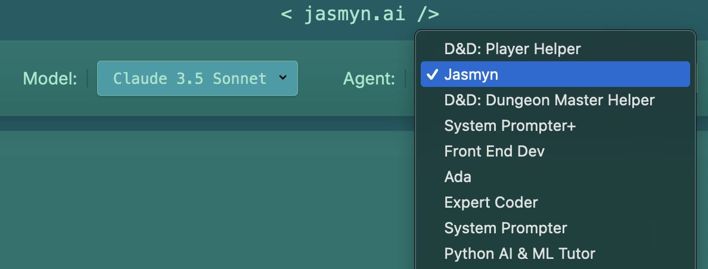

This is a personal AI chat server developed by Esme Keats @esyeng. All rights reserved. MIT License.

# JasmynAI - Personalized AI Agent conversational dashboard

### Note:
Application not currently accessible to new users. Reasoning: This app depends on paid API services that are currently only set up to work with my personal account and I'm not intending to charge for its use with this set up. Thus I've disabled new user sign ups while I update the python backend to allow for new users, who will provide their own API keys to use the software. This project is ongoing, I'll update this page once the app is open to all! For now feel free to view/download/fork the code.

Main Page

Agent Menu



Run the development server:

```bash

pnpm install
# then

npm run dev
# or
yarn dev
# or
pnpm dev
# or
bun dev
```

## Frontend:

### Stack:
NextJS, React (TypeScript), TailwindCSS, radix-ui, Clerk

### Completed:
- dropdown to select model (which will open proper channel with backend) (this lives in Options.tsx
- a clean, responsive user / assistant chat window complete with input and send button. (think iMessage, chatgpt)
- a design theme with tailwindcss
- a user/pw authentication interface.
- sidebar menu, open by default on desktop, or via hamburger on small viewports and/or mobile. within it:
     - a place to store simple notes, persists across sessions
     - a conversations / threads list component that allows for creating new threads, and saving them for the logged in user. active threads should persist across sessions.
- export thread button to save formatted conversation to file

### Todo:
- a menu with sliders to adjust temperature, max tokens (to add to Options.tsx)
- secure input field for storing keys
- Make threads delete-able
- User info component, editable & synced to db

